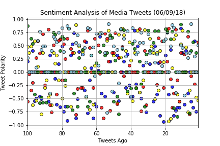

## Media Sentiment Analysis
Download the latest tweets from various news outlets, including BBC, CBS, CNN, Fox News, and the New York Times. Perform sentimate analysis on these tweets for positive or negative sentiment in the outlets' reporting. Finally, create Matplotlib visualizations of the results. This was performed on June 9, 2018 and includes tweets taken from dates leading up to then.

## Sentiment Analysis of Media Tweets

## Overall Media Sentiment

## Conclusions

 - CBS is remarkably positive, much more so than the other four networks. That channel must have found some recent positive event(s) to report on that slipped past the other networks.

 - CNN is the most negative in their reporting, which might make sense as its reputation for being a more liberal news station and their negative coverage of the Trump regime

 - From quick inspection, CNN (blue) and NYT (red) in the past 100 tweets plot seem to have the most variance in their tweets. This perhaps means that they take on the widest range of material to report; also it could mean that their reporting is inconsistent.